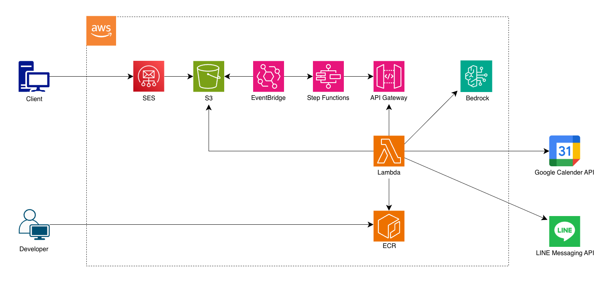

# calendar-auto-register

メールで受信したイベント情報を LLM で解析し、自動的に Google カレンダーへ登録して LINE で結果を通知するアプリケーション。

## 本リポジトリの目的

- **カレンダー登録の手間削減**: メール受信からカレンダーへの手動登録を自動化し、カレンダーへの登録漏れを予防
- **非構造化データの抽出検証**: LLMを活用し、メール本文のような非構造化テキストからイベント情報の自動抽出を検証
- **Lambdalithパターンの検証**: 単一の AWS Lambda 関数上で FastAPI を動作させ、単一関数内で複数のAPIエンドポイントを提供する Lambdalith アーキテクチャを検証

## 機能

- **メール解析**: S3 に保存されたメールファイルを取得・解析
- **LLM による情報抽出**: Bedrock 経由で Claude を使用し、メール本文からイベント情報を抽出
- **Google カレンダー登録**: 抽出したイベント情報を一括で Google カレンダーに登録
- **LINE 通知**: 登録結果（成功/失敗の件数と詳細）を LINE に通知

## アーキテクチャ

### 全体構成

このプロジェクトは **Lambdalith** パターン（単一の Lambda 関数に複数の API エンドポイントを持つ設計） を検証するために実装されている。

### 利用技術
- AWS Lambda Python (Lambdalith パターン)
- FastAPI（API 実装）
- AWS API Gateway（Lambda への HTTP インターフェース）
- AWS S3（RAW メール保存）
- AWS Step Functions（ワークフローオーケストレーション）
- AWS EventBridge（S3 イベントトリガー）
- LangChain（LLM インターフェース）
- Amazon Bedrock（LLM プロバイダー）
- Google Calendar API（カレンダー登録）
- LINE Notify API（登録通知）


#### アーキテクチャ図


### Step Functions ワークフロー

```
┌─────────────────────────────────┐
│  [Start]                        │
└────────────┬────────────────────┘
             ↓
┌─────────────────────────────────┐
│ [API: POST /mail/parse]         │
│ → S3 からメールを取得              │ 
└────────────┬────────────────────┘
             ↓
┌─────────────────────────────────┐
│ [API: POST /llm/extract-event]  │
│ → LLM でメール解析                │
└────────────┬────────────────────┘
             ↓
┌─────────────────────────────────┐
│ [API: POST /calendar/events]    │
│ → Google カレンダーに登録          │
└────────────┬────────────────────┘
             ↓
┌─────────────────────────────────┐
│ [API: POST /line/notify]        │
│ → LINE に結果を通知               │
└────────────┬────────────────────┘
             ↓
┌─────────────────────────────────┐
│ [End]                           │
└─────────────────────────────────┘
```

※この構成はあくまで検証のため本アプリケーションレベルだと過剰設計であり、API で分割することなく単一の Lambda 関数で完結させるのが本来は望ましい。

---

## 開発環境セットアップ

### local コンテナ（開発）

`docker/Dockerfile.local` をターゲットにし、AWS CLI / uv / 開発用ツールを含むイメージを生成する。

```bash
# 初回のみ
docker compose build local

# Python / AWS CLI / uv のバージョン確認
docker compose run --rm local python --version
docker compose run --rm local aws --version
docker compose run --rm local uv --version
```

`docker compose build local` 実行時に `uv pip install --system ".[dev]"` が走り、アプリ本体と `pytest` / `ruff` / `mypy` などの開発依存がまとめてコンテナ内へインストールされる。

FastAPI をブラウザから確認する場合は、以下のコマンドでホットリロード付きのサーバーを立ち上げる（`PYTHONPATH=app/src` を `docker-compose.yml` で指定しているため、ソースの変更が即時反映される）。

```bash
docker compose run --rm --service-ports local-web \
  uv run uvicorn calendar_auto_register.main:app \
  --host 0.0.0.0 --port 8000 --reload --log-level debug --access-log
```

#### ローカルでの動作確認（curl例）

別ターミナルでサーバーを起動したまま、以下を実行して疎通を確認できる。

```bash
# healthz
curl -X GET http://localhost:8000/healthz

# /mail/parse(メール取得)
curl -X POST http://localhost:8000/mail/parse \
  -H "Content-Type: application/json" \
  -d '{"s3_key":"2025/11/09/demo-mail.eml"}'

# /llm/extract-event（メール本文から予定抽出）
curl -X POST http://localhost:8000/llm/extract-event \
  -H "Content-Type: application/json" \
  -d '{
    "normalized_mail": {
      "from_addr": "sales@example.com",
      "reply_to": null,
      "subject": "【12/25】営業会議のご案内",
      "received_at": "2024-12-20T04:46:00Z",
      "text": "各位\n\nいつもお世話になっております。営業会議のご案内です。\n\n【日時】2024/12/25(水) 14:00-15:00\n【場所】オンライン\n【議題】四半期決算\n\nご出席のほどよろしくお願いいたします。\n",
      "html": null,
      "attachments": []
    }
  }'

# /calendar/events(カレンダー一括登録)
curl -X POST http://localhost:8000/calendar/events \
  -H "Content-Type: application/json" \
  -d '{
    "events": [
      {
        "summary": "営業会議",
        "start": {
          "dateTime": "2024-12-25T14:00:00+09:00",
          "timeZone": "Asia/Tokyo"
        },
        "end": {
          "dateTime": "2024-12-25T15:00:00+09:00",
          "timeZone": "Asia/Tokyo"
        },
        "location": "オンライン",
        "description": "議題: 四半期決算"
      }
    ]
  }'

# /line/notify（LINE通知）
curl -X POST http://localhost:8000/line/notify \
  -H "Content-Type: application/json" \
  -d '{
    "results": [
      {
        "status": "CREATED",
        "event": {
          "summary": "⚙️ 営業会議",
          "start": {
            "dateTime": "2024-12-25T14:00:00+09:00",
            "timeZone": "Asia/Tokyo"
          },
          "end": {
            "dateTime": "2024-12-25T15:00:00+09:00",
            "timeZone": "Asia/Tokyo"
          },
          "location": "オンライン",
          "description": "議題: 四半期決算",
          "eventType": "default"
        },
        "google_event_id": "event-1"
      }
    ]
  }'
```

### Lint / Type Check / Test

開発コンテナ内で以下のコマンドを実行すると、フェーズ1で整備したツールが順番に動作する。

```bash
docker compose run --rm local uv run pytest
docker compose run --rm local uv run ruff check
docker compose run --rm local uv run mypy app/src
```

PyCharm などの IDE からテストを実行する場合は、Docker Compose Interpreter で `local` サービスを指定し、`python -m pytest` を呼ぶよう設定すること。

### prod コンテナ（本番相当検証）

```bash
# 必要に応じて build
docker compose build prod

# Python バージョンのみ確認
docker compose run --rm prod python --version

# 例：本番想定の依存確認
docker compose run --rm prod bash -lc "python -c 'import os; print(\"APP_ENV=\", os.environ.get(\"APP_ENV\"))'"
```

いずれの環境でも AWS 認証情報が必要な場合は、必要に応じてホストの `~/.aws` を読み取り専用でマウントすること。

```bash
docker compose run --rm \
  -v "$HOME/.aws:/root/.aws:ro" \
  -e AWS_PROFILE=default \
  local aws sts get-caller-identity
```

---

## デプロイメント

本番環境へのデプロイは `scripts/sam-deploy.sh` で行う。AWS SAM + Lambda + API Gateway により、API エンドポイント（`/healthz`, `/mail/parse`, `/calendar/events`, `/line/notify` など）が自動的にセットアップされる。  


### デプロイ後の接続設定

- **実際のエンドポイント URL とリクエスト例**: `DEPLOYMENT_PROD.md` を参照（非公開ファイル）
- **認証**: IAM ロール（Lambda 実行ロール）で認可制御
- **ヘッダー**: `Content-Type: application/json` を指定

詳細は `infra/sam/template.yaml` の API Gateway 設定と Lambda の IAM ロール ポリシーを参照。

### AWS デプロイ（SAM + API Gateway）

1. `cp .env.deploy.example .env.deploy` で SAM / デプロイ用パラメータファイルを作成（リージョン、Stack 名、SSM パラメータ名、RAWメールバケット名など）。
   - 例: `AWS_REGION`, `STACK_NAME`, `PROJECT_NAME`, `SSM_DOTENV_PARAMETER`（例: `/calendar-auto-register/dotenv`）、`S3_RAW_MAIL_BUCKET`, `ECR_IMAGE_REPOSITORY`, `IMAGE_TAG`, `AWS_PROFILE`
2. `cp .env.example .env.prod` を作成し、機密を含むアプリ設定（Google/Bedrock/メール/S3 など）を prod 向けに上書きする（ここには `SSM_DOTENV_PARAMETER` など参照先は入れず、純粋なアプリ設定のみを記載）。
3. `infra/sam/samconfig.toml` は共通設定のみを保持しているため、スクリプトは `.env.deploy` を読み取って `sam build` / `sam deploy` に必要な値を渡す。
4. デプロイは以下のスクリプトで一括実行できます。`SAM_CONFIG_ENV` や `ENV_FILE` を切り替えることで dev/prod など複数環境に対応できる。

```bash
SAM_CONFIG_ENV=default ./scripts/sam-deploy.sh
```

`ApiEndpointType=REGIONAL` を渡せば VPC エンドポイントが未準備でも動作確認でる（本番は PRIVATE + IAM を推奨）。

#### SSM に dotenv（.env.prod）をまとめて保存する

prod 環境では `.env.prod` の内容を 1 つの SecureString として Parameter Store に登録し、Lambda 初期化時に読み込んで `os.environ` に展開する。

```bash
aws ssm put-parameter \
  --name "${SSM_DOTENV_PARAMETER:-/calendar-auto-register/dotenv}" \
  --type SecureString \
  --value "$(cat .env.prod)" \
  --overwrite \
  --region "${AWS_REGION:-ap-northeast-1}"
```

---

### Hello World 実行

Docker 内で Python が動作するか確認するため、`app/src/hello.py` に最小のスクリプトを用意している。

```bash
docker compose run --rm local python app/src/hello.py
```

期待出力（例）:

```
Hello from calendar-auto-register via Docker!
```
