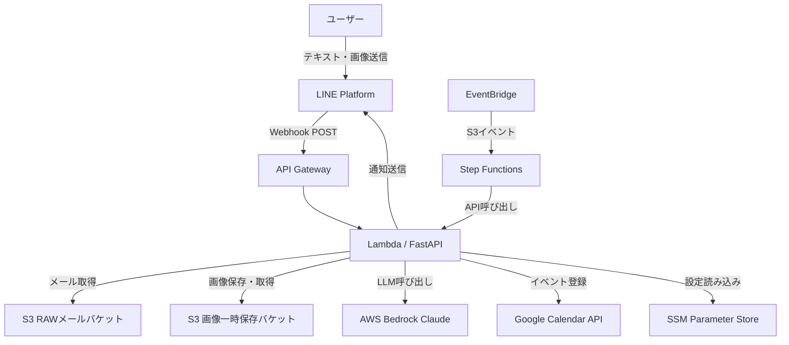
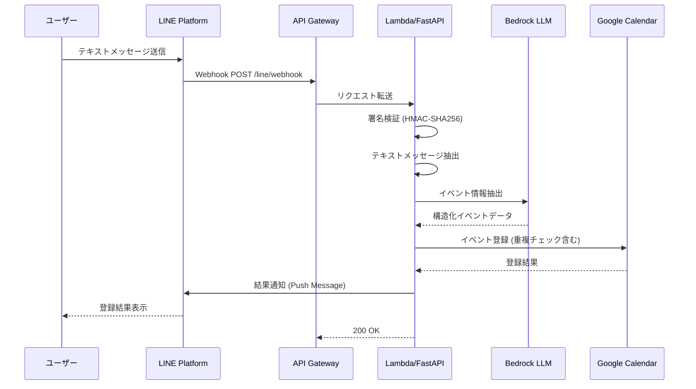
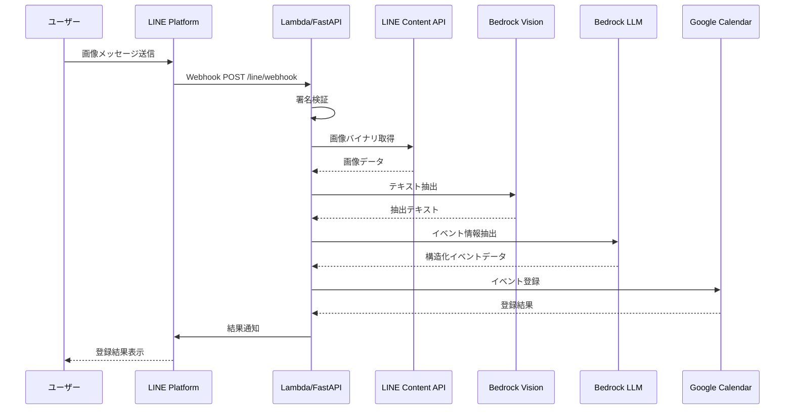
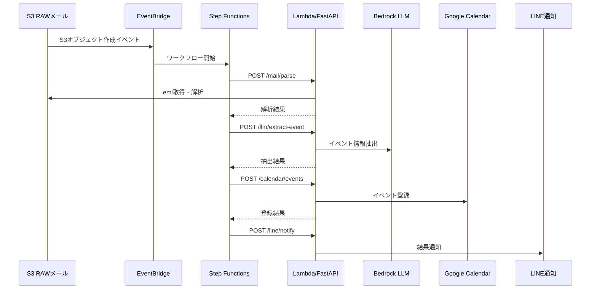

# 機能設計書 (Functional Design Document)

## システム構成図



## 技術スタック

| 分類 | 技術 | 選定理由 |
|------|------|----------|
| 言語 | Python 3.12 | 型ヒント充実、LangChain/Bedrock SDKのエコシステムが豊富 |
| フレームワーク | FastAPI 0.115+ | 非同期対応、Pydanticによる型安全なスキーマ定義、自動OpenAPIドキュメント生成 |
| スキーマ定義 | Pydantic 2.8+ | FastAPIとの統合、高速なバリデーション |
| LLMインターフェース | LangChain 1.2+ / LangChain-aws 1.2+ | Bedrock統合、プロンプト管理、リトライ機構 |
| Lambdaアダプタ | Mangum 0.17+ | ASGI to Lambda変換、API Gateway互換 |
| LINE SDK | line-bot-sdk 3.12+ | LINE Messaging API公式SDK |
| Google API | google-api-python-client 2.132+ | Google Calendar API公式クライアント |
| AWS SDK | boto3 1.34+ | S3/Bedrock/SSM/Textract連携 |
| HTTPクライアント | httpx 0.27+ | 非同期対応HTTPクライアント |

## データモデル定義

### エンティティ: NormalizedMail

```python
@dataclass(slots=True)
class NormalizedMail:
    """S3上の .eml から抽出した統一メールモデル。"""
    from_addr: str | None
    reply_to: str | None
    subject: str | None
    received_at: datetime | None
    text: str | None
    html: str | None
    attachments: list[str] = field(default_factory=list)
```

### エンティティ: CalendarEvent

```python
@dataclass(slots=True)
class CalendarEvent:
    """Google Calendar SDK へ渡すイベント情報。"""
    summary: str
    start_at: datetime
    end_at: datetime
    timezone: str
    location: str | None = None
    description: str | None = None
```

### エンティティ: GoogleCalendarEventModel (Pydanticスキーマ)

```python
class GoogleCalendarEventModel(BaseModel):
    """Google Calendar events.insert() 互換形式"""
    summary: str
    start: DateModel | DateTimeModel
    end: DateModel | DateTimeModel
    location: str | None = None
    description: str | None = None
    eventType: str = "default"
```

### エンティティ: LineMessageEvent（新規）

```python
class LineMessageEvent(BaseModel):
    """LINE Webhookメッセージイベント"""
    type: Literal["message"]
    message: LineMessage
    timestamp: int
    source: LineSource
    reply_token: str

class LineMessage(BaseModel):
    type: Literal["text", "image", "video", "audio", "file", "location", "sticker"]
    id: str
    text: str | None = None  # type="text"の場合のみ

class LineSource(BaseModel):
    type: Literal["user", "group", "room"]
    user_id: str
```

### エンティティ: ExtractedText（新規）

```python
class ExtractedText(BaseModel):
    """画像からの抽出テキスト"""
    text: str
    confidence: float | None = None
    method: Literal["bedrock_vision", "textract"]
```

## コンポーネント設計

### features/line_webhook/ （新規）

**責務**:
- LINE Webhookリクエストの受信と署名検証
- メッセージタイプの判定とオーケストレーション
- テキスト/画像メッセージの処理フロー制御

**インターフェース**:
```python
# router_line_webhook_post.py
router = APIRouter(prefix="/line", tags=["line"])

@router.post("/webhook")
async def line_webhook(request: Request) -> Response:
    """LINE Webhookエンドポイント。署名検証後、イベントを処理する。"""
    ...
```

```python
# usecase_line_webhook_post.py
async def handle_webhook_events(
    events: list[LineWebhookEvent],
    settings: Settings,
) -> None:
    """Webhookイベントを処理する。
    テキスト: LLM抽出 → カレンダー登録 → LINE通知
    画像: 画像DL → Vision抽出 → LLM抽出 → カレンダー登録 → LINE通知
    """
    ...
```

**依存関係**:
- `clients/bedrock_client.py`（LLM抽出）
- `clients/google_client.py`（カレンダー登録）
- `clients/line_client.py`（LINE通知）
- `features/vision_extract/`（画像テキスト抽出）

### features/vision_extract/ （新規）

**責務**:
- LINE Content APIからの画像ダウンロード
- Bedrock Vision / Textractによる画像テキスト抽出

**インターフェース**:
```python
# router_vision_extract_post.py
router = APIRouter(prefix="/vision", tags=["vision"])

@router.post("/extract-text")
async def extract_text(
    request: VisionExtractRequest,
    settings: Settings = Depends(get_settings),
) -> VisionExtractResponse:
    """画像からテキストを抽出する。"""
    ...
```

```python
# usecase_vision_extract_post.py
async def extract_text_from_image(
    image_source: ImageSource,
    settings: Settings,
) -> ExtractedText:
    """画像ソースからテキストを抽出する。"""
    ...
```

**依存関係**:
- `clients/http_client.py`（LINE Content API画像ダウンロード）
- `clients/bedrock_client.py`（Bedrock Vision呼び出し）
- `clients/s3_client.py`（画像一時保存）

### features/llm_extract/ （既存）

**責務**: テキストからLLM(Bedrock Claude Haiku)でイベント情報を構造化抽出

### features/calendar_events/ （既存）

**責務**: Google Calendarへのイベント登録、重複チェック

### features/line_notify_post/ （既存）

**責務**: LINE Messaging APIでの通知送信

### features/mailparse_post/ （既存）

**責務**: S3からのメール取得・解析

## ユースケース図

### UC-1: テキストメッセージからカレンダー登録



**フロー説明**:
1. ユーザーがLINE BOTにテキストメッセージを送信
2. LINE PlatformがWebhookでアプリケーションに通知
3. アプリケーションが署名検証を実施
4. テキストをBedrock LLMに送信し、イベント情報を構造化抽出
5. Google Calendarに登録（±15分の時間窓で重複チェック）
6. 登録結果をLINE Push Messageで通知

### UC-2: 画像メッセージからカレンダー登録



### UC-3: メールからカレンダー登録（既存）



## API設計

### POST /line/webhook（新規）

**リクエスト**:
```json
{
  "destination": "xxxxxxxxxx",
  "events": [
    {
      "type": "message",
      "message": {
        "type": "text",
        "id": "1234567890",
        "text": "明日14時から営業会議"
      },
      "timestamp": 1640000000000,
      "source": {
        "type": "user",
        "userId": "U1234567890abcdef"
      },
      "replyToken": "xxxxx"
    }
  ]
}
```

**ヘッダー**:
- `X-Line-Signature`: HMAC-SHA256署名

**レスポンス**: `200 OK`（空ボディ）

**エラーレスポンス**:
- 403 Forbidden: 署名検証失敗

### POST /vision/extract-text（新規）

**リクエスト**:
```json
{
  "image_source": {
    "type": "line_message",
    "message_id": "1234567890"
  }
}
```

**レスポンス**:
```json
{
  "extracted_text": "イベント名: 新年会\n日時: 2025年1月15日 18:30-21:00\n場所: 渋谷〇〇ビル 3F"
}
```

**エラーレスポンス**:
- 400 Bad Request: 画像ソース不正
- 502 Bad Gateway: Vision API呼び出し失敗

### 既存エンドポイント

| エンドポイント | メソッド | 機能 |
|---|---|---|
| `/healthz` | GET | ヘルスチェック |
| `/mail/parse` | POST | S3からメール取得・解析 |
| `/llm/extract-event` | POST | Bedrock LLMでイベント抽出 |
| `/calendar/events` | POST | Google Calendarに登録 |
| `/line/notify` | POST | LINE通知送信 |

## エラーハンドリング

### エラーの分類

| エラー種別 | 処理 | ユーザーへの表示 |
|-----------|------|-----------------|
| Webhook署名検証失敗 | 403返却、ログ記録 | （通知なし - 不正リクエスト） |
| LINE Content API失敗 | リトライ後、LINE通知 | 「画像の取得に失敗しました」 |
| Vision API失敗 | リトライ2回後、LINE通知 | 「画像からテキストを抽出できませんでした」 |
| LLM抽出失敗 | リトライ5回後、LINE通知 | 「イベント情報を抽出できませんでした」 |
| Calendar API失敗 | リトライ3回後、LINE通知 | 「カレンダー登録に失敗しました」 |
| LINE通知失敗 | リトライ3回、CloudWatchログ | （通知不能 - ログのみ） |
| タイムアウト | CloudWatchアラート | 処理途中で中断された旨のログ |

### リトライポリシー

| 処理 | リトライ回数 | バックオフ |
|------|-------------|-----------|
| LLM抽出 | 5回 | エクスポネンシャル |
| Google Calendar登録 | 3回 | 2秒間隔 |
| LINE通知 | 3回 | 2秒間隔 |
| Vision API | 2回 | 3秒間隔 |

## セキュリティ考慮事項

- Webhook署名検証: LINE Channel Secretを用いたHMAC-SHA256でリクエスト改ざんを検知
- 画像データ保護: S3プライベートバケットに一時保存、24時間後に自動削除
- 機密情報管理: SSM Parameter Store (SecureString) で一元管理、コード内にハードコードしない
- API Key認証: 既存ミドルウェアでBearerトークン検証（Webhook以外のエンドポイント）

## テスト戦略

### ユニットテスト
- Webhook署名検証ロジック
- LINE Webhookイベントパース
- Vision APIクライアント（Bedrock Vision / Textract）
- 画像処理フロー（メッセージタイプ判定）

### 統合テスト
- テキストメッセージ → LLM抽出 → カレンダー登録 → 通知（モック使用）
- 画像メッセージ → OCR → LLM抽出 → カレンダー登録 → 通知（モック使用）
- エラーケース（署名失敗、画像読み取り失敗、LLM抽出失敗）

### E2Eテスト
- ステージング環境で実際のLINE BOTにメッセージ送信
- カレンダーイベント登録確認
- LINE通知受信確認
